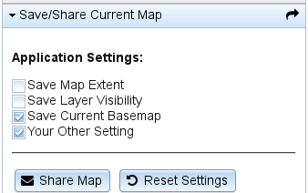
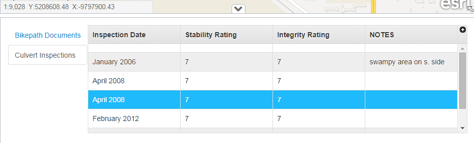
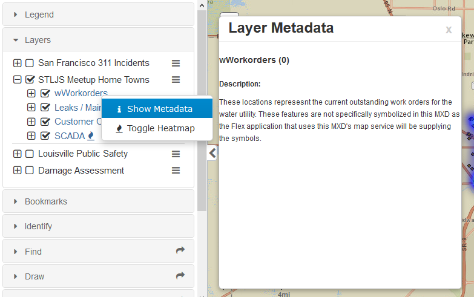
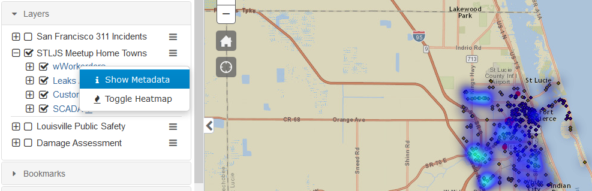
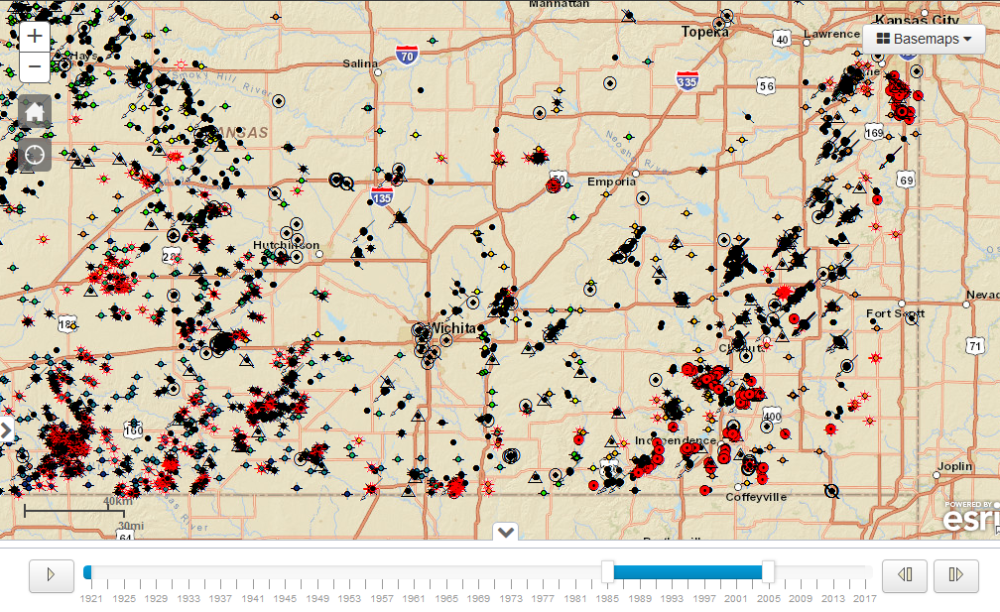

CMV Widgets
===========

Dojo Widgets to extend the functionality of the Esri Javascript API and [CMV](https://github.com/cmv/cmv-app). Documentation on how to use these widgets can be found in their respective folder. While designed to work specifically for CMV, they should function just as well outside of CMV in a different Dojo or Esri API app.

Check out the [demo branch](https://github.com/roemhildtg/cmv-widgets/tree/demo) for a fully functional demo.

### AppSettings

* Store and share map and application state.
* [View the Documentation](widgets/AppSettings/):

### RelatedRecordsTable

* Query and display the layers' related records
* [View the Documentation](widgets/RelationshipTable/)

### MetadataDialog

* Query the layer's rest page and display it's description
* [View the Documentation](widgets/MetadataDialog/)

### HeatMap

* Toggle a dynamic heatmap renderer on point layers
* [View the Documentation](widgets/HeatMap/)

### TimeSlider

* Control the current display of all time enabled layers ont he map
* [View the Documentation](widgets/TimeSlider)

### LoginCookie

* Cache logins in a cookie or local storage and reload them when the app starts
* [View the Documentation](widgets/LoginCookie)
