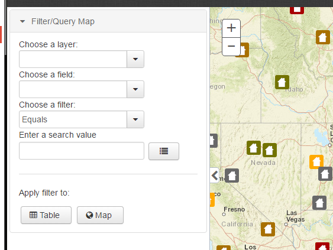

# Filter

A drop in widget to allow the user to filter any layer by any field and value.



## Demo:

A demo is available at the [gh-pages branch using the config=filter-config](http://roemhildtg.github.io/cmv-widgets/?config=filter-config)

## Features:

 - Allow the user to build custom filters using a series of dropdown menus
 - Filter dynamic layers on the map
 - Open the cmv attribute table with the filter

## Usage

In viewer.js (see below for descriptions of parameters):

```javascript
filter: {
    include: true,
    id: 'filter',
    position: 10,
    type: 'titlePane',
    path: 'path/widgets/Filter',
    title: 'Filter Data',
    options: {
      layerControlLayerInfos: true
    }
}
```

## Options Parameters:

Key        | Type     | Default | Description
---------- | -------- | ------- | -----------------------------------------------------------------------
layerInfos | `Object` | -       | In CMV config, set layerControlLayerInfos to true to include layerInfos

## Limitations
 - Only one filter is currently supported per layer or table
 - Options are not configureable at the moment, future enhancements may include excluding layers and fields

## Changes

5/1/2017: Initial publish
