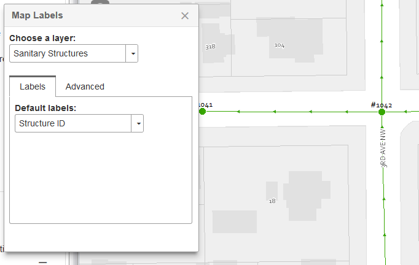
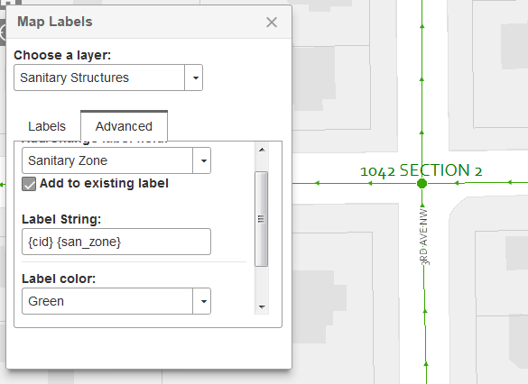

# Label Layer Widget

Create and modify client side label layers using existing dynamic map layers. Features
automatic indexing of all dynamic map layers in `layerInfos` and minor font
modification capabilities planned (currently supports color).

Useful in either any of the cmv types, and uses `dojo.topic` to open or show itself
when the topic is published.

Configure predefined labels:


Allow users to build complex labels:


## CMV config

**Title Pane**

```javascript
labelLayer: {
    title: 'Map Labels',
    id: 'labelLayer',
    include: true,
    type: 'titlePane',
    position: 15,
    path: 'roemhildtg/LabelLayer',
    options: {
        // required!
        map: true,
        layerControlLayerInfos: true


        // automatically created labels
        // [{
        //        layer: 'layer_id',
        //        sublayer: 13, // only for dynamic layers
        //        visible: true,
        //        name: 'Diameter - Material', //displayed to user
        //        expression: '{diameter}" {material}' //label string
        //        color: '#000',
        //        fontSize: 8,
        //        url: 'url to feature layer ' //if we want to create it,
        //        title: 'layer title',
        //  }]
        // the available select dropdowns for each layer
        // labelSelections: {
        //     assets: { // layer id
        //         13: [{  // sublayer id
        //             name: 'Diameter - Material', //displayed to user
        //             value: '{diameter}" {material}' //label string
        //     }]
        // },
        //
        // // override the default colors
        // colors: [{
        //     name: 'Black',
        //     id: '#000'
        // }],
        //
        // // set the default color choice using the id
        // color: '#000',
        //
        // //default font size
        // fontSize: 8,
    }
},
```

**Floating Style**

```javascript
labelLayer: {
    title: 'Map Labels',
    id: 'labelLayer',
    include: true,
    type: 'floating',
    position: 15,
    path: 'roemhildtg/LabelLayer',
    options: {
        //options here (see above)
    }
},
```

Use layer control to publish the topic when the layer a layer's menu is selected:

```javascript
layerControl: {
    include: true,
    id: 'layerControl',
    type: 'titlePane',
    path: 'gis/dijit/LayerControl',
    title: 'Layers',
    open: true,
    position: 0,
    options: {

        // add a menu option to feature layers
        menu: {
          feature: [{
              label: 'Labels',
              topic: 'showLabelPicker',
              iconClass: 'fa fa-font fa-fw'
          }]
        },

        // add a sublayer menu for dynamic layers
        subLayerMenu: {
            dynamic: [{
                label: 'Labels',
                topic: 'showLabelPicker',
                iconClass: 'fa fa-font fa-fw'
            }]
        },
        map: true,
        layerControlLayerInfos: true,
        separated: true,
        vectorReorder: true,
        overlayReorder: true
    }
}

```

## Outside of CMV use

```javascript
require(['roemhildtg/LabelLayer'], function(LabelLayer){
  new LabelLayer({
    layerInfos: [{
      //cmv layer info
    }],
    map: mapObject, //esri map object
  }, 'domNode');
});
```
