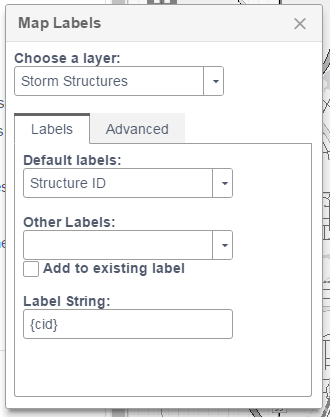
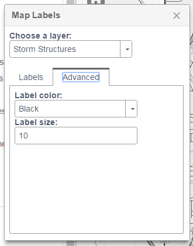

# Label Layer Widget

Create and modify client side label layers using existing dynamic and feature map layers. Features
automatic indexing of all dynamic map layers in `layerInfos` and minor font
modification capabilities planned (currently supports color).

Useful in either any of the cmv types, and uses `dojo.topic` to open or show itself
when the topic is published.

In addition, supports automatically added labels.

Configure predefined labels:



Allow users to build complex labels:



## CMV config

**Map Options**

This widget requires the map option `showLabels: true` enabled in order for
labels to show up in your map.

**Title Pane**

```javascript
labelLayer: {
    title: 'Map Labels',
    id: 'labelLayer',
    include: true,
    type: 'titlePane',
    position: 15,
    path: 'roemhildtg/LabelLayer',
    options: {
        // required!
        map: true,
        layerControlLayerInfos: true,


        // OPTIONAL!!
        // label layer options to exclude layers and exclude fields
        // similar to cmv identify config
        labelInfos: {
          <layerId>: { // a string like 'assets'
            exclude: false, // exclude this entire layer
            <subLayerId>: { // a number representign the map service layer id
              exclude: false, // set the sublayer to be excluded from the label widget
              fields: [{
                alias: 'Field Label',
                name: 'field_name'
              }],

              // the available select dropdowns for each layer
              selections: [{  // sublayer id
                  name: 'Diameter - Material', //displayed to user
                  value: '{diameter}" {material}' //label string
              }]
            }
          }
        },
        //
        // automatically created labels
        defaultLabels: [{
               layer: 'layer_id',
               sublayer: 13, // only for dynamic layers
               visible: true,
               name: 'Diameter - Material', //displayed to user
               expression: '{diameter}" {material}' //label string
               color: '#000',
               fontSize: 8,
               url: 'url to feature layer ' //if we want to create it,
               title: 'layer title',
         }],
        //
        //
        // // override the default colors
        // colors: [{
        //     name: 'Black',
        //     id: '#000'
        // }],
        //
        // // set the default color choice using the id
        // color: '#000',
        //
        // //default font size
        // fontSize: 8,
    }
},
```

**Floating Style**

```javascript
labelLayer: {
    title: 'Map Labels',
    id: 'labelLayer',
    include: true,
    type: 'floating',
    position: 15,
    path: 'roemhildtg/LabelLayer',
    options: {
        //options here (see above)
    }
},
```

Use layer control to publish the topic when the layer a layer's menu is selected:

```javascript
layerControl: {
    include: true,
    id: 'layerControl',
    type: 'titlePane',
    path: 'gis/dijit/LayerControl',
    title: 'Layers',
    open: true,
    position: 0,
    options: {

        // add a menu option to feature layers
        menu: {
          feature: [{
              label: 'Labels',
              topic: 'showLabelPicker',
              iconClass: 'fa fa-font fa-fw'
          }]
        },

        // add a sublayer menu for dynamic layers
        subLayerMenu: {
            dynamic: [{
                label: 'Labels',
                topic: 'showLabelPicker',
                iconClass: 'fa fa-font fa-fw'
            }]
        },
        map: true,
        layerControlLayerInfos: true,
        separated: true,
        vectorReorder: true,
        overlayReorder: true
    }
}

```

## Outside of CMV use

```javascript
require(['roemhildtg/LabelLayer'], function(LabelLayer){
  new LabelLayer({
    layerInfos: [{
      //cmv layer info
    }],
    map: mapObject, //esri map object
  }, 'domNode');
});
```

## Changelog

#### 4/27/2017:

**Change Notes:**

 * Added the ability to exclude layers by id and sublayer id
 * Added the ability to exclude fields from a layer by overriding the field config
 * Fixed an issue with the creation of default label layers
 * Added a loading icon when fields are being retrieved from the server

 **New Config API:**
 Changes to the config were made to simplify excluding layers and fields. As a
 result, existing configs will have to be migrated.

  * `labelInfos` is the new primary config property. This is similar to the cmv identify config. Each label infos consts of a nested object
  * `labelSelections` has been changed to a property on the `labelInfos` called `selections`
  * Note: `defaultLabels` has not changed its position in the config

  Old Config:
  ```javascript
  labelSelections: [{
    name: 'My label name',
    value: '{label_field} - {other_field}'
  }]
  ```

  New Config:
  ```javascript
  layerId: {
    0: {
      selections: [{
        name: 'My label name',
        value: '{label_field} - {other_field}'
      }]
    }
  }
  ```
